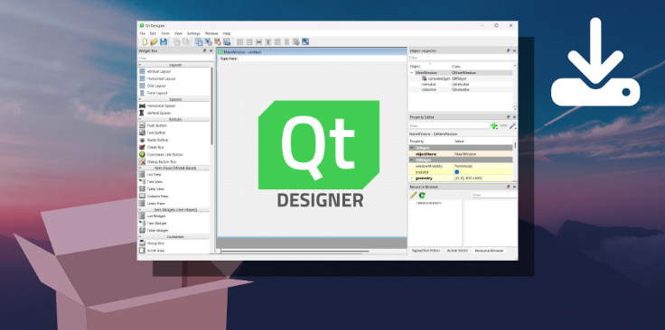
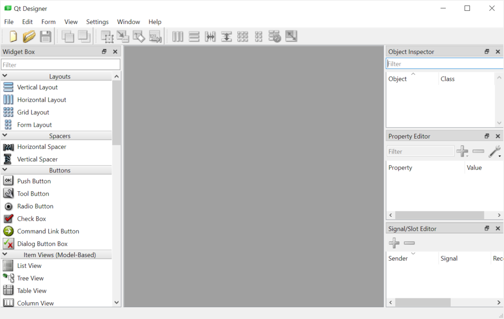
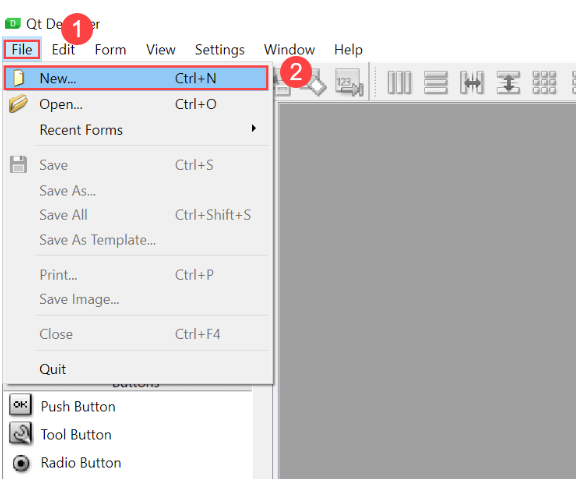
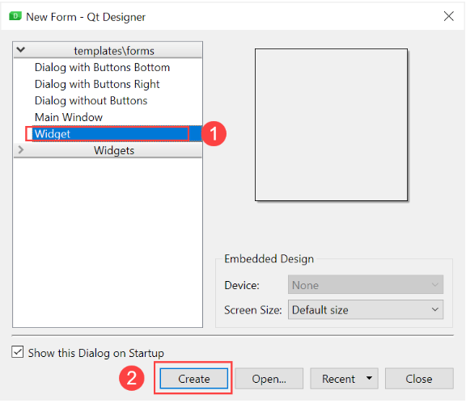
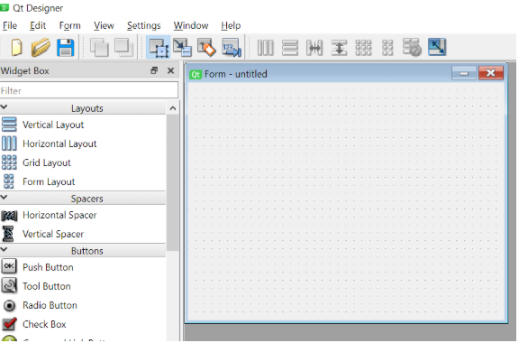
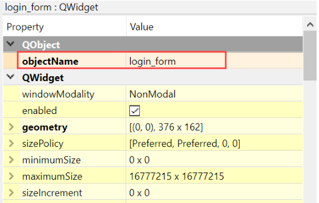
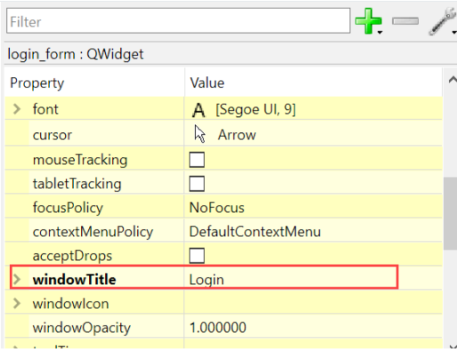
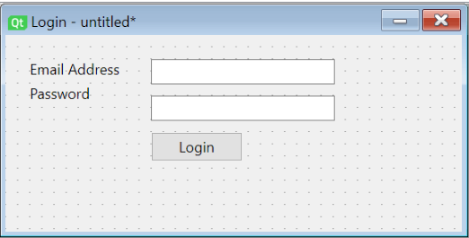

### PyQt Designer Tools ***Python GUI***

---

### How Installing?

### `Windows`
```
$ pip install winshell pywin32 prettytable keyboard
```

`OR`

- install for File By `VBScript`
  
```
$ SetupWin.vbs
```

---

### `Linux`
```
$ pip install winshell pywin32 prettytable keyboard --break-system-packages
```

---



---

### PyQt Command line launcher

```
pip install pyqt6-tools
```

```
pyqt6-tools designer
```

---

### The Qt Designer will look like this:


---

### Creating a login form 

- We’ll create a simple **login** form using the `Qt designer` and load it into our Python program.
- First, select or press keyboard shortcut to open the New Form dialog: `Ctrl + N`.



---

- Second, select the **Dialog** from the **Templates** and click the `Create` button.


---

- It’ll create a as follows:`QWidget`



---

- **You can set the layout for the widget, and drag and drop widgets from the Widget Box to the form.**

### Setting widget properties

- In the Property Editor, you can set a name for the widget e.g., `login_form`





---

### Adding widgets to the login form

- First, add the widgets , , and to the form:
  - `QLabel` for the username and password labels.
  - `QLineEdit` for the username and password input fields.
  - `QPushButton` for the login button.


---

| Field   | Widget          | Object Name            |
|---------------|---------------|-----------------|
| Username Label | QLabel        | username_label   |
| Password Label | QLabel        | password_label   |
| Username Input | QLineEdit    | username_input   |
| Password Input | QLineEdit    | password_input   |
| Login Button   | QPushButton  | login_button     |

---

- **The generated the from the file. The contains the following generated Python**

- code: `pyuic6login_form.py` `login_form.ui` `login_form.py`

---

```python
# Form implementation generated from reading ui file 'login_form.ui'
#
# Created by: PyQt6 UI code generator 6.1.0
#
# WARNING: Any manual changes made to this file will be lost when pyuic6 is
# run again.  Do not edit this file unless you know what you are doing.


from PyQt6 import QtCore, QtGui, QtWidgets


class Ui_login_form(object):
    def setupUi(self, login_form):
        login_form.setObjectName("login_form")
        login_form.resize(269, 108)
        self.formLayout = QtWidgets.QFormLayout(login_form)
        self.formLayout.setObjectName("formLayout")
        self.label = QtWidgets.QLabel(login_form)
        self.label.setObjectName("label")
        self.formLayout.setWidget(0, QtWidgets.QFormLayout.ItemRole.LabelRole, self.label)
        self.email_line_edit = QtWidgets.QLineEdit(login_form)
        self.email_line_edit.setObjectName("email_line_edit")
        self.formLayout.setWidget(0, QtWidgets.QFormLayout.ItemRole.FieldRole, self.email_line_edit)
        self.label_2 = QtWidgets.QLabel(login_form)
        self.label_2.setObjectName("label_2")
        self.formLayout.setWidget(1, QtWidgets.QFormLayout.ItemRole.LabelRole, self.label_2)
        self.password_line_edit = QtWidgets.QLineEdit(login_form)
        self.password_line_edit.setEchoMode(QtWidgets.QLineEdit.EchoMode.Password)
        self.password_line_edit.setObjectName("password_line_edit")
        self.formLayout.setWidget(1, QtWidgets.QFormLayout.ItemRole.FieldRole, self.password_line_edit)
        self.btn_login = QtWidgets.QPushButton(login_form)
        sizePolicy = QtWidgets.QSizePolicy(QtWidgets.QSizePolicy.Policy.Fixed, QtWidgets.QSizePolicy.Policy.Fixed)
        sizePolicy.setHorizontalStretch(0)
        sizePolicy.setVerticalStretch(0)
        sizePolicy.setHeightForWidth(self.btn_login.sizePolicy().hasHeightForWidth())
        self.btn_login.setSizePolicy(sizePolicy)
        self.btn_login.setObjectName("btn_login")
        self.formLayout.setWidget(2, QtWidgets.QFormLayout.ItemRole.FieldRole, self.btn_login)

        self.retranslateUi(login_form)
        QtCore.QMetaObject.connectSlotsByName(login_form)

    def retranslateUi(self, login_form):
        _translate = QtCore.QCoreApplication.translate
        login_form.setWindowTitle(_translate("login_form", "Login"))
        self.label.setText(_translate("login_form", "Email Address"))
        self.label_2.setText(_translate("login_form", "Password"))
        self.btn_login.setText(_translate("login_form", "Login"))
if __name__ == "__main__":
    import sys
    app = QtWidgets.QApplication(sys.argv)
    login_form = QtWidgets.QDialog()
    ui = Ui_login_form()
    ui.setupUi(login_form)
    login_form.show()
    sys.exit(app.exec())
```

---

| system | Compatibility |
|--------|---------------|
|  | Windows 7/8/10/11 |
|  | Linux (Ubuntu, Fedora, Debian, etc.) |
|  | macOS (Catalina, Big Sur, Monterey, etc.) |
---|---

---
### Requirements
- Python 3.6 or higher
- PyQt6
- PyQt6-tools
- Qt Designer
---
### Installation
1. Install Python 3.6 or higher from the 
- [](https://www.python.org/ftp/python/3.11.0/python-3.11.0rc2-amd64.exe)
2. Install PyQt6 and PyQt6-tools using pip:
```
pip install PyQt6 PyQt6-tools
```
3. Install Qt Designer (usually comes with PyQt6-tools).

4. Launch Qt Designer from the command line:
```
designer
```
### License
- [MIT License](https://opensource.org/licenses/MIT)
